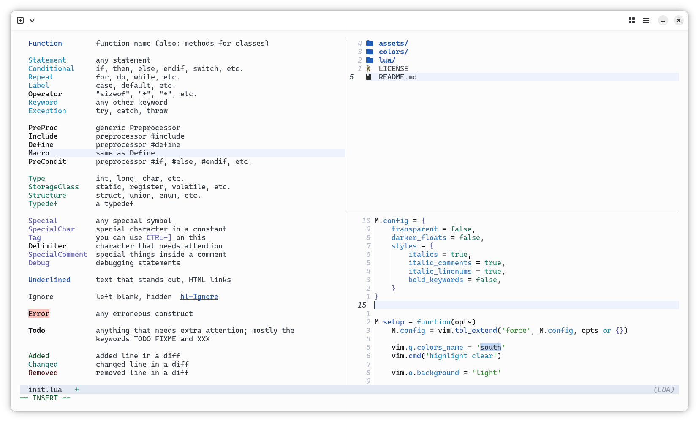
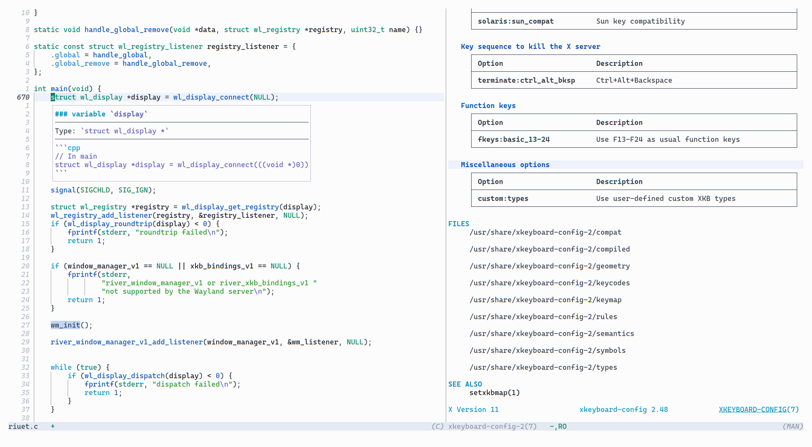

# South for Neovim

A bright, summery Neovim theme 🌱☀️🌊

> This is a Neovim port of the original Emacs [south](https://github.com/SophieBosio/south) theme. 

Licensed under GPL-3.0.

The text colours are WCAG AA compliant against the background, except the
colour used for comments and specific UI elements, but not WCAG AAA compliant.

## Screenshots

### Lua



### C



## Installation

### Using Neovim 0.12+'s native package manager `vim.pack`:

```lua
vim.pack.add({
    { src = 'https://github.com/arnauKL/south.nvim' }
})

-- configuration (optional)
require 'south'.setup({
    transparent = true,
    darker_floats = true,
    styles = {
        italic_linenums = false,
    }
})

vim.cmd.colorscheme('south')
```

### Using `lazy.nvim` (Neovim 0.7+)

```lua
{
    'arnauKL/south.nvim',
    lazy = false,
    priority = 1000,
    config = function()
        -- Optional configuration goes here
        require('south').setup({
            transparent = false,
            -- ...
        })
        vim.cmd.colorscheme('south')
    end
}
```

## Configuration

Default options are configured to stay as close as possible to the original Emacs theme:

```lua
require('south').setup({
    transparent = false,        -- Skips setting editor backgrounds if true
    darker_floats = false,      -- Forces solid floating windows/menus even if transparent
    styles = {
        italics = true,         -- Master switch for font slant overrides
        italic_comments = true, -- Toggles italicized comments (ignored if italics = false)
        italic_linenums = true, -- Toggles italicized line numbers (ignored if italics = false)
        bold_keywords = false,  -- Applies bold weight to syntax keywords
    }
})
```

### Accessing palette colors

If you want to use south colors in custom highlights or statusline plugins:

```lua
local palette = require 'south'.get_palette()

-- then, colors are accessible via palette.grass, palette.denim, palette.black, etc.
```

## Supported plugins

Out of the box I developed this port mostly for myself so I've only added support
for the plugins I use:

- [telescope.nvim](https://github.com/nvim-telescope/telescope.nvim)
- [WhichKey](https://github.com/folke/which-key.nvim)
- [oil.nvim](https://github.com/stevearc/oil.nvim)
- [fzf-lua](https://github.com/ibhagwan/fzf-lua)
- Markdown heading markup

Everything else falls back to editor highlights. If you'd like to add support
for other plugins, feel free to submit a PR!

## Contributing

### Strict No LLM / No AI Policy

Use of generative AI/LLMs is strictly forbidden for all contributions to `south.nvim`.

This includes bug reports and comments on the issue tracker.

## Acknowledgements

- [Sophie Bosio](https://github.com/SophieBosio) for designing the original Emacs `south` theme and palette, thanks for creating this lovely theme. 
- [vague.nvim](https://github.com/vague-theme/vague.nvim) for the inspiration behind the plugin's code modularity.
